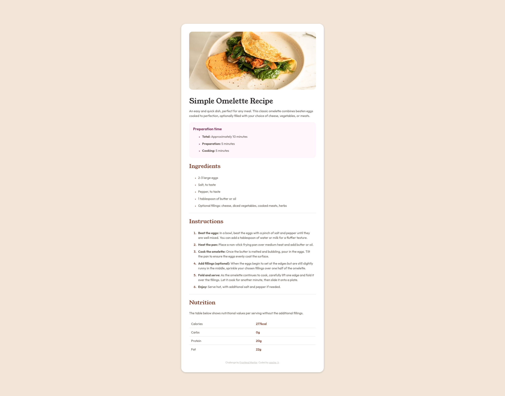

# Frontend Mentor / The Odin Project | Recipe Page Challenge

This is a solution to the [Recipe page challenge on Frontend Mentor](https://www.frontendmentor.io/challenges/recipe-page-KiTsR8QQKm), while also being a solution to [The Odin Preoject's Recipes project](https://www.theodinproject.com/lessons/foundations-recipes). 

Frontend Mentor challenges help you improve your coding skills by building realistic projects. 

## Table of contents

- [Screenshot](#screenshot)
- [Links](#links)
- [Built with](#built-with)
- [Useful resources](#useful-resources)
- [Author](#author)
- [Acknowledgments](#acknowledgments)

### Screenshot

### Links

- [Solution URL](https://github.com/sascha-lr/odin-ft-fem-recipes)
- [Live Site URL](https://sascha-lr.github.io/odin-ft-fem-recipes/)

### Built with

- Semantic HTML5 markup
- CSS custom properties
- Flexbox
- CSS Grid
- Mobile-first workflow

### Useful resources

- [The Odin Project](https://www.theodinproject.com/) - The Odin Project is the best coding curriculum I have ever taken and I wholeheartedly recommend it.

## Author

- Frontend Mentor - [@sascha-lr](https://www.frontendmentor.io/profile/sascha-lr)
- GitHub - [@sascha-lr](https://github.com/sascha-lr/)
